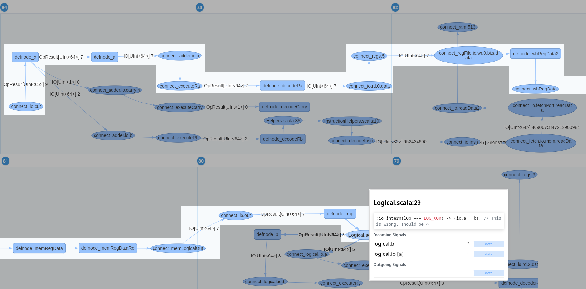

# ChiselTrace: Automatic Signal Dependency Tracing for Chisel

This repository contains the ChiselTrace project. ChiselTrace is a source-level debugging tool for the Chisel hardware construction language. By automatically analysing and visualising simulation-time data- and control-flow dependencies between statements in the Chisel source code, ChiselTrace aims to reduce the amount of time spent tracing back faults to the root cause in the waveform viewer, thereby improving the Chisel debugging experience.

ChiselTrace builds on the [Tywaves](https://github.com/rameloni/tywaves-chisel) project, a typed waveform viewer for Chisel. ChiselTrace implements the following stages:

- A Chisel extension that extracts a program dependence graph and a control flow graph from a FIRRTL circuit, while inserting instrumentation probes.

- A Rust library (chiseltrace-rs) that takes the produced graphs and synthesises this information, along with a VCD file and CIRCT debug information, into a dynamic program dependence graph (only dependencies that occurred in the simulation) that is annotated with typed Tywaves simulation data.

- A graph viewer front-end that enables interactive dependency exploration

- An extension to ChiselSim to automatically launch ChiselTrace on failed assertions.


## Installation

Build instructions are provided for Linux only. Although ChiselTrace may work under Windows, it has only been tested on Linux.

### Dependencies

To install ChiselTrace, Tywaves also needs to be installed. While it is technically possible to use ChiselTrace without Tywaves-Surfer, this is not recommended. Please make sure to install the [Tywaves prerequisites](https://github.com/jarlb/tywaves-chisel/tree/main?tab=readme-ov-file#prerequisites). For convenience, they are listed here as well:

> - [Make](https://www.gnu.org/software/make/)
> - [Scala and sbt](https://docs.scala-lang.org/getting-started/sbt-track/getting-started-with-scala-and-sbt-on-the-command-line.html)
  and [scala-cli](https://scala-cli.virtuslab.org/install) (_Note: Java versions prior to Java 11, tywaves may not work
  correctly_)
> - [Rust](https://www.rust-lang.org/tools/install)
> - `openssl` for installing the waveform
  gui ([instructions](https://gitlab.com/rameloni/surfer-tywaves-demo#compiling-from-source))
> - [Verilator](https://www.veripool.org/projects/verilator/wiki/Installing) (recommended `v4.228+`)

In addition, ChiselTrace depends on Tauri. Please install [all of its prerequisites](https://v2.tauri.app/start/prerequisites/) and run the following command:

```bash
cargo install tauri-cli --version "^2.0.0" --locked
```

This will enable you to build the ChiselTrace executable.

### Installing ChiselTrace Components

To install Tywaves and ChiselTrace, run the `make all` command. This will automatically pull all required repositories and install all required components.

To remove temporary files, run `make clean`.

### FAQ

This section shows some frequently encountered errors.

- I get the following error: `Error: scala.reflect.internal.MissingRequirementError: object java.lang.Object in compiler mirror not found.`
  - This is caused by a wrong Java version. The software is known to work with [Temurin JDK 21](https://adoptium.net/temurin/releases/). If the issue persists, add `export JAVA_HOME="/usr/lib/jvm/temurin-21-jdk"` to a setup script.
- I get the following error: `circt.stage.phases.Exceptions$FirtoolNotFound: Error resolving firtool`
  - This error is encountered when the CIRCT path is not set correctly. This is fixed by adding `export PATH="/home/<your_user_here>/.local/bin:$PATH"` to a setup script.


## Getting Started

Before proceeding, make sure the ChiselTrace main executable (the GUI) is on your `$PATH`.

There are two main ways to use ChiselTrace: via the command line, or via a custom ChiselSim simulator. This section will provide instructions for both cases, using the following example circuit.

```scala
class GCD extends Module {
  val io = IO(new Bundle {
    val a             = Input(UInt(32.W))
    val b             = Input(UInt(32.W))
    val loadValues    = Input(Bool())
    val result        = Output(UInt(32.W))
    val resultIsValid = Output(Bool())
  })

  val x = Reg(UInt(32.W))
  val y = Reg(UInt(32.W))

  val tmp = x + y
  when(x > y) {
    x := x -% y 
  }.otherwise {
    y         := y -% x
  }

  when(io.loadValues) {
    x := io.a
    y := io.b
  }

  io.result        := x
  io.resultIsValid := y === 0.U
}
```

We will first discuss how to use the custom simulator. ChiselTrace's custom simulator is based on the one found in Tywaves. A regular Tywaves simulation would be launched using a unit test as follows:

```scala
describe("TywavesSimulator") {
  it("runs GCD correctly") {
    import TywavesSimulator._

    simulate(new GCD(), Seq(VcdTrace, WithTywavesWaveforms(true))) {
      gcd =>
        gcd.io.a.poke(24.U)
        gcd.io.b.poke(36.U)
        gcd.io.loadValues.poke(1.B)
        gcd.clock.step()
        gcd.io.loadValues.poke(0.B)
        gcd.clock.stepUntil(sentinelPort = gcd.io.resultIsValid, sentinelValue = 1, maxCycles = 10)
        gcd.io.resultIsValid.expect(true.B)
        gcd.io.result.expect(12)
        ...........
    }
  }
}
```

If the assertions at the end of the unit test were to fail, the test would crash. The `ChiselTraceDebugger` is a drop in replacement:

```scala
describe("ChiselTraceDebugger") {
  it("runs GCD correctly") {
    import ChiselTraceDebugger._

    simulate(new GCD(), Seq(VcdTrace, WithTywavesWaveforms(true))) {
      gcd =>
        gcd.io.a.poke(24.U)
        gcd.io.b.poke(36.U)
        gcd.io.loadValues.poke(1.B)
        gcd.clock.step()
        gcd.io.loadValues.poke(0.B)
        gcd.clock.stepUntil(sentinelPort = gcd.io.resultIsValid, sentinelValue = 1, maxCycles = 10)
        gcd.io.resultIsValid.expect(true.B)
        gcd.io.result.expect(13)
        ...........
    }
  }
}

```

Now, if an assertion were to fail (which, in this case it will, due to the 13 instead of 12), you would get the following prompt in your terminal:

```text
> Assertion failed. Context: Expectation failed: observed value 12 != 13
> continue? (Y/n/t/dt)
```

Choosing `Y` or `n` will continue or fail the unit test. By selecting `t` or `dt`, you can intiate a ChiselTrace session on the asserted signal. `t` will do a full traceback, while `dt` will only trace data dependencies.

ChiselTrace may also be invoked manually via the terminal command `chiseltrace`. You should use the following arguments:

```text
  -s, --slice-criterion <SLICE_CRITERION>
          Criterion in format 'type:value' (e.g., 'statement:connect_io.a', or 'signal:io.a')
  -p, --pdg-path <PDG_PATH>
          Path to the program dependency graph exported by chisel
  -v, --vcd-path <VCD_PATH>
          Path to the VCD file
      --hgldd-path <HGLDD_PATH>
          Path to the HGLDD directory
  -t, --top-module <TOP_MODULE>
          The name of the top-level module
  -e, --extra-scopes <EXTRA_SCOPES>...
          Specifies additional scopes that will be used while processing. This will most likely be "TOP svsimTestbench dut"
  --max-timesteps <MAX_TIMESTEPS>
      Sets a maximumum amount of timesteps to analyse
  --data-only <DATA_ONLY>
      Only trace data dependencies [possible values: true, false]
  --hier-grouping <HIER_GROUPING>
      Enables hierarchical node grouping [possible values: true, false]
  --fir <FIR>
      Disables conversion to Chisel representation [possible values: true, false]
  -h, --help
          Print help
  -V, --version
          Print version

```

For the GCD example, the command could look like this:

```bash
chiseltrace --slice-criterion signal:io.result --pdg-path ./pdg.json --vcd-path ./path_to_vcd/trace.vcd --hgldd-path ./path_to_hgldd --top-module GCD --extra-scopes TOP svsimTestbench dut --max-timesteps 16
```

## Features

- PDG / CFG generation at the FIRRTL level
  - Dependency tracking for `wire`, `node`, `reg`, and memories, with the exception of `SRAM`.
  - Tracks individual signals from compound signals.
  - Inserts probes into the circuit for dynamically resolved dependencies
  - Encodes dynamic dependencies in exported graphs.
- DPDG generation and program slicing
  - Static / dynamic (non-executable) program slicing of Chisel circuits using the CLI
  - DPDG generation of FIRRTL circuits using the produced graphs and simulation data
  - Conversion of FIRRTL DPDG to Chisel representation
  - Injection of Tywaves simulation data into the DPDG
- DPDG viewer
  - Tauri + vis.js-based DPDG viewer with timeline visualisation
  - User-adjustable node positions after automatic placement.
  - Node and edge visualisation based on node type (connection / condition / IO) and dependency type (data / conditional / index).
  - Hover-over to display file and source code associated with Chisel statement
  - Typed tywaves simulation data shown as data-flow on edges + on hover menu.
  - Hierarchical node grouping and graph-head resetting to reduce graph complexity.
  - Automatically launches ChiselTrace session upon failing assertions.


## Case-study

The functionality of ChiselTrace has been demonstrated on [ChiselWatt](https://github.com/jarlb/chiselwatt). The repository contains [the updated version of ChiselWatt](https://github.com/rameloni/chiselwatt/tree/migrate-to-chiselsim) with a fault injected into one of the modules. A traceback of the fault can be seen below. More details can be found in the results section of the ChiselTrace Thesis.



## Future Work

- Improve the Chisel reconstruction from DPDGs in FIRRTL representation. The reconstruction stage of ChiselTrace sometimes fails to reconstruct an accurate Chisel view for nodes, especially if higher-level standard library constructs are involved. Methods that could solve this issue could consist of more heuristic graph processing in the reconstruction stage, and switching to different FIRRTL source-mappings that map to a specific Chisel statement instead of a location in the source code.
- Extend the functionality to work on multiple clock-domains and allow registers to be use any signal as clock or reset. This would involve changes in the information that needs to be collected from the FIRRTL circuit and changes in the DPDG building. 
- Integrate the ChiselTrace library with the Tywaves-Surfer waveform viewer to enable automatically adding signals to the waveform viewer that are dependencies of a particular transition. Furthermore, this could enable jumping to the location of an active driver of a signal in the source code.
- Add more graph processing to the front-end. One improvement could be automatically tracing a value to its root cause. This is a feature that also exists in Verdi's Temporal Flow View. Another interesting addition would be automatically calculating the difference between the DPDG under a test that produces wrong results versus a test that executes correctly.
- Create alternative front-ends for ChiselTrace, such as a Visual Studio Code extension. Such an extension could enable a user to jump to the active driver of a signal, similar to how a jump to definition works.
- Enable user-defined abstractions for data-flow. An example of this could be a communication transaction between components. An abstracted view could show only one data dependency for the entire transaction.
- Extend ChiselTrace to other HGLs. The ChiselTrace front-end and chiseltrace-rs could be partially reused for an implementation for another language. One big challenge would be to come up with an alternative way to process at the FIRRTL level, as not all languages translate to a similar IR before compilation.

## License

This work is licensed under the [Apache Licence 2.0](https://www.apache.org/licenses/LICENSE-2.0).
